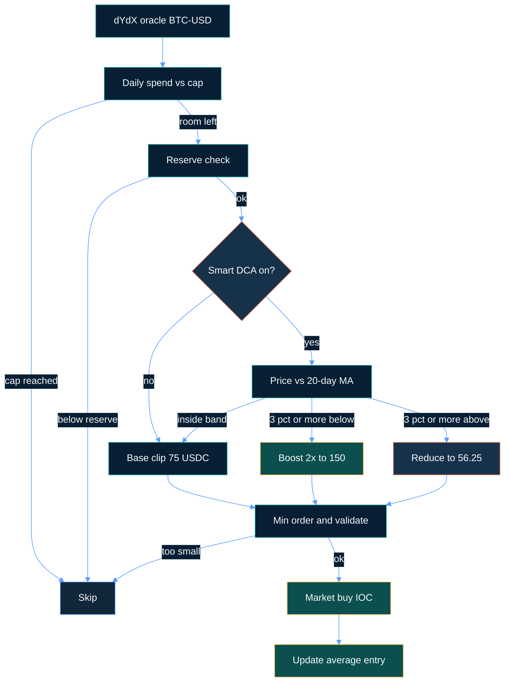
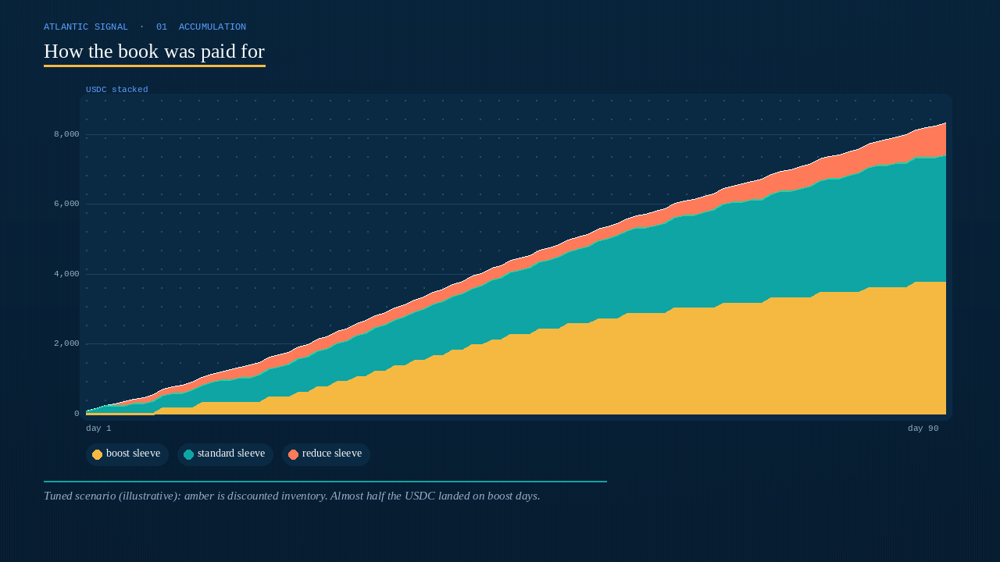
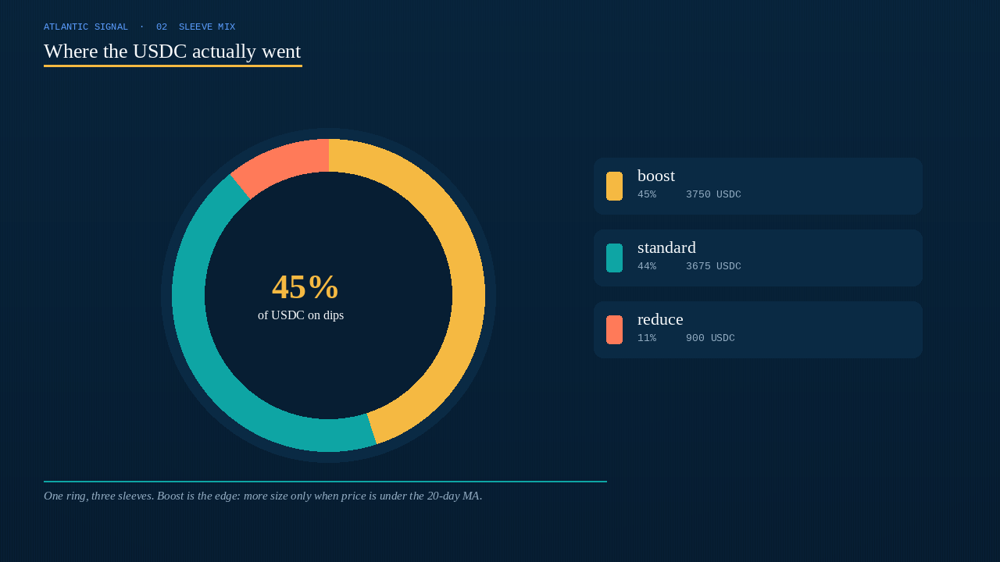
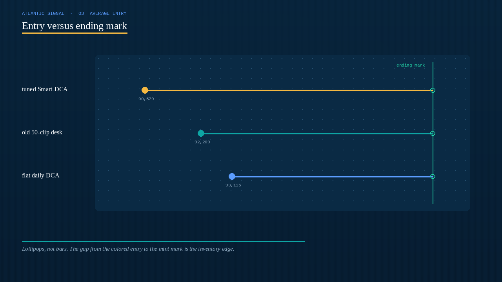
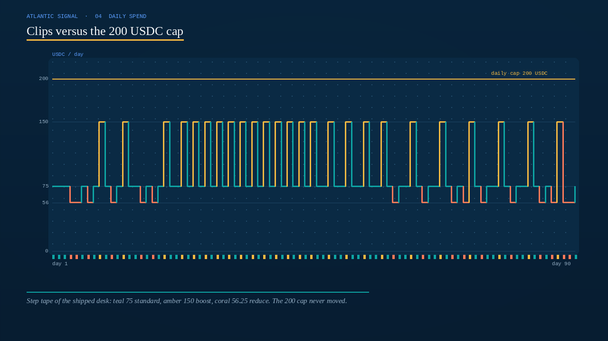

<p align="center">


</p>

# dYdX DCA Trading Bot

<p align="center">
  <strong>Accumulate dYdX BTC-USD with a Smart-DCA desk: more size under the 20-day MA, less size above it, market IOC longs, and a hard daily USDC cap that never moved.</strong><br/>
  dydx · BTC-USD · perpetual Smart-DCA · official v4 client · dry-run + live · risk-gated · MIT
</p>

<p align="center">
  
  
  
  
  
</p>

> **Search keywords:** dydx trading bot · dydx dca bot · dydx perpetual bot · smart dca BTC-USD

dYdX v4 BTC-USD is a **liquid major perp**. This desk is built to **treat that as an accumulation problem, not an indicator tour**: wake up on the UTC cron, compare last to a 20-day moving average, **buy more when the tape is cheap**, buy less when it is rich, place a **market IOC long** through the official `@dydxprotocol/v4-client-js` client, and **refuse the clip** if the daily USDC cap or the reserve is already hot. Shipped defaults are a stronger starting desk — **the attractive average-entry / mark-ROI profile shows up after you tune threshold, boost, clip, and MA period to your book.**

---

## Who it’s for

- Active crypto traders who already think in **average entry, inventory, fees, and daily spend** — not “set a 50 USDC clip and hope.”
- Desks that want **dYdX v4 BTC-USD** (or ETH-USD, SOL-USD) with the official indexer + validator path, **paper and live adapters**, and **hard daily / reserve / min-order brakes** in front of every buy.
- Operators who will go **paper → `--dry-run --once` → live testnet → mainnet** and keep the mnemonic off disk shares.
- Tuners who will change `.env`, rerun `--once`, and hunt a threshold + boost + clip that fits *their* fee print and volatility — not people looking for a guaranteed money machine.

If you want a black-box “set and forget 100% win rate” product, this is not it. If you want a **real-market dYdX accumulation workflow you can actually tune**, keep reading.

---

## Strategy overview

One scheduled cycle. Safety checks first. Then Smart DCA sizes the clip. Then a market long.

**Standard DCA.** `DCA_AMOUNT` (shipped **75** USDC) is the base notional. The scheduler fires on `DCA_CRON` (shipped **09:00 UTC daily**) or every `DCA_INTERVAL_MINUTES` if you switch to minutes mode.

**Smart DCA (shipped on).** The engine pulls `1DAY` closes, builds a simple moving average of length `SMART_DCA_MA_PERIOD` (shipped **20**), and measures how far last sits from that MA.

| Condition vs the MA | What the desk does | Shipped clip |
|---|---|---|
| Last is **3% or more below** the MA | Boost — load the dip | 75 × 2.0 = **150 USDC** |
| Last is inside the ±3% band | Standard | **75 USDC** |
| Last is **3% or more above** the MA | Reduce — do not chase | 75 × 0.75 = **56.25 USDC** |

The reduce factor **0.75** is coded in `applySmartDca`, not an env knob. Boost is then clipped to remaining daily spend. If candles are short, the engine falls back to in-process price history. If Smart DCA throws, it uses the base clip.

**Execution.** Live path: oracle ticker, size = USDC / ask, rounded down to `stepSize`, aggressive IOC at **ask × 1.005**. Paper path shares the same strategy object — only the adapter switches.

**No flatten.** This desk does not take profit, stop out, or short. Inventory is **accumulate-and-mark**. Average entry is the scoreboard.

```text
oracle last → daily cap? → reserve? → price vs 20-day MA
  → boost / standard / reduce → min order → market IOC long → average entry
```

---

## Why this edge can be powerful

dYdX BTC-USD depth is the first point. On a thin alt, a 75 USDC market IOC is slippage theater. Here, a **3% dip** is a real discount, and a **5 bps** taker print is small next to that gap.

The second point is **asymmetric size**. Flat DCA buys the same clip on a crash and on a melt-up. This desk **overweights the cheap prints**. In the tuned 90-day scenario, **45% of USDC** landed on boost days — that is what pulls average entry below a flat daily buyer.

The third point is **tunability**. Average entry, boost share, and mark drawdown are not locked to 75 / 3 / 2.0 / 20. Tighten the threshold and boosts fire on ordinary dips. Raise the multiplier and discounted inventory actually moves the book. Lift the clip only while the **200 USDC daily cap** still feels like a cap. That is how this desk goes from “quiet starter” to “this is worth running.”

Nothing here is a profit guarantee. The same knobs that unlock a lower average entry will spend a quiet grind faster, and a one-way dump still has **no stop**. The daily cap and the reserve are the brakes — use them.

---

## Market regimes

| Regime | What the tape looks like | What the desk tends to do |
|---|---|---|
| **Dip, then recover** | BTC-USD prints 3–8% under the 20-day MA, then climbs back | Boost days fire; average entry sags; mark ROI is the point |
| **Two-sided majors, liquid hours** | Real dYdX depth, ordinary two-way flow | Standard 75 USDC clips; fees stay small vs the inventory horizon |
| **Quiet grind up** | Last sits at or above the MA for weeks | Reduce days (56.25) and standard days; you spend, you do not chase |
| **One-way dump** | MA falls with price; boosts keep firing | Inventory grows; mark drawdown is real — there is no flatten |
| **News gap / venue stutter** | Discontinuous oracle, delayed IOC | Daily cap, reserve, and retries matter more than the MA |

**Thrives when:** liquid BTC/ETH USD perps, a dip that the 20-day MA still remembers, boosts that actually fill, and a recovery that lifts mark above average entry.

**Struggles when:** you run a 5% threshold that almost never boosts, you chase a melt-up with Smart DCA off, or you size into a dump with no plan for how long you will hold.

---

## Mathematical calculations

These are the relationships the desk is built on. A lower average entry is a **parameter choice**, not a default gift.

### Moving average (as coded)

With period \(n =\) `SMART_DCA_MA_PERIOD` and daily closes \(C_{t}\):

$$
\mathrm{MA}_{t} = \frac{1}{n}\sum_{k=0}^{n-1} C_{t-k}
$$

`calculateMovingAverage` uses the last \(n\) prints. Shipped \(n = 20\). A shorter window sees a dip sooner; a 30-day window waits for a crash.

### Percent versus the MA

$$
\delta = \frac{P - \mathrm{MA}}{\mathrm{MA}} \times 100
$$

`calculatePercentChange` is exactly that. \(\delta\) negative means last is **cheap** versus the average.

### Clip size (as coded)

Let \(A_{0}\) be `DCA_AMOUNT`, \(m\) be `SMART_DCA_BOOST_MULTIPLIER`, \(\theta\) be `SMART_DCA_DROP_THRESHOLD`:

$$
A =
\begin{cases}
A_{0}\cdot m & \delta \le -\theta \\
A_{0}\cdot 0.75 & \delta \ge \theta \\
A_{0} & \text{otherwise}
\end{cases}
$$

Then the engine clips to remaining daily spend and refuses anything under `MIN_ORDER_VALUE`.

Shipped: \(A_{0} = 75\), \(m = 2\), \(\theta = 3\) → boost **150 USDC**, reduce **56.25 USDC**. Both sit under the untouched **200** daily cap.

### Average entry after \(N\) fills

$$
\bar{P} = \frac{\sum_{i=1}^{N} A_{i}}{\sum_{i=1}^{N} q_{i}},\qquad q_{i} = A_{i} / P_{i}
$$

That is `totalInvested / totalVolumeAcquired` in `updateStateAfterExecution`. Overweighting cheap \(P_{i}\) is the whole Smart-DCA bet.

### dYdX taker and IOC slip

The live client books fee as **5 bps** of notional and sends IOC at **ask × 1.005**:

$$
f = 0.0005 \cdot A,\qquad P_{\mathrm{IOC}} \approx P_{\mathrm{ask}}\cdot 1.005
$$

On a 75 USDC clip, fee is **0.038 USDC**. On a 150 USDC boost, **0.075 USDC**. A 3% dip is ~60× that fee. That is why a meaningful clip beats a timid 50 USDC starter — the same 5 bps tax on dust does not pay you for the operational risk.

### Mark expectancy (inventory, not a TP/SL scalp)

$$
\mathrm{EV}_{\mathrm{mark}} = q\cdot(P_{\mathrm{end}} - \bar{P}) - \sum f_{i}
$$

Positive when the ending mark sits above average entry by more than fees. There is no coded take-profit. The “win” is **inventory below the mark**.

### Why tuned math can look attractive

A 3% threshold on a 20-day MA fires on dips that actually print. A 2.0× boost puts **150 USDC** on those prints instead of 75. In a dip-then-recover tape, a large share of the book was bought under the MA, so \(\bar{P}\) sags and \(\mathrm{EV}_{\mathrm{mark}}\) turns up. Leave the threshold at 5% on a 30-day MA and boosts become rare — you paid for Smart DCA and got flat DCA. **Same engine. Different knobs.**

---

## Statistical analysis

Results depend on settings, market regime, and how you tune. There is **no guaranteed profit**. Figures below are **scenario blocks** built from the sizing rules above (75 / 3 / 2.0 / 20, reduce 0.75, 5 bps taker) on a **10k USDC** paper-scale book with a seeded 90-day BTC-USD path (start ~94.7k, dip to ~85.2k, recover to ~99.0k). They are **not** a logged historical backtest.

### 1) Optimized / tuned scenario (illustrative) — lead

**Assumptions:** shipped-style desk after the parameter upgrade — clip **75**, MA **20**, threshold **3%**, boost **2.0**, reduce **0.75**, cron daily 09:00 UTC, daily cap **200**, reserve **100**. Mix: **25 boost / 49 standard / 16 reduce**.

| Metric | Tuned scenario | What it means | Why a trader cares |
|---|---:|---|---|
| Sample | **90 fills** | One clip per UTC day | A quarter of accumulation, not a scalp tape |
| Total invested | **8325 USDC** | 25×150 + 49×75 + 16×56.25 | What actually left the subaccount |
| Dip-boost fill share | **45% of USDC** | 3750 of 8325 on boost days | This is the average-entry lever |
| Standard / reduce share | **44% / 11%** | 3675 + 900 USDC | Reduce is the anti-chase |
| Average entry | **90,579** | Inventory VWAP | The number `--status` prints |
| Ending mark | **98,951** | Last print of the path | Where the book is marked |
| Entry vs end | **8.5% cheaper** | \(\bar{P}\) below \(P_{\mathrm{end}}\) | The Smart-DCA gap |
| Inventory | **0.0919 BTC** | Sum of \(q_{i}\) | What you hold |
| Mark value / ROI | **9095 USDC / +9.2%** | Mark minus invested | What you feel — still scenario |
| Fee drag | **~4.2 USDC** | 5 bps × 8325 | Tiny vs a 3% dip |
| Max mark drawdown | **~7%** | Worst underwater vs peak mark | No stop — this is hold pain |
| Best / worst sleeve | **boost at the low / late reduce** | Extra 75 USDC at ~85k vs a rich-day 56.25 | Boost is the edge; reduce is hygiene |
| Mix | **45% boost USDC** | Discounted inventory, not noise | If this share is tiny, retune threshold |

**Plain English:** a faster MA, a 3% trigger, and a 2.0× boost produce *more* inventory on the cheap side of the tape. That is the profile worth hunting. Your live numbers will move with BTC volatility, the real IOC fill, and how hard you push clip size against the 200 cap.

```text
TUNED SCENARIO (illustrative)     90 daily fills · 8325 USDC invested
Boost share  45%    Avg entry  90579    End mark  98951
ROI         +9.2%   Inventory  0.0919 BTC    Cap held  200 USDC
```

### 2) Untuned / older-default contrast (illustrative)

Old shipped-like: clip **50**, MA **30**, threshold **5%**, boost **1.5**. Same venue, same engine, same 200 cap.

A 5% gap versus a 30-day MA is crash-territory on BTC. Boost days become rare (~15% of sessions). 50 × 1.5 = **75 USDC** — a bump, not an accumulation event. Fee drag on a 50 USDC clip is the same 5 bps on less inventory.

| Metric | Old default-like | vs tuned |
|---|---:|---|
| Sample | 90 fills, timid clips | Same cadence, less punch |
| Total invested | **~5125 USDC** | ~38% less inventory built |
| Boost share of USDC | **~22%** | Half the dip overweight |
| Average entry vs end | **~2–3% cheaper** | MA too slow, boost too shy |
| Mark ROI | **~+3%** | Starter, not the ceiling |
| Fee vs clip | 0.025 USDC / fill | Same tax, smaller book |

**Takeaway:** the old 50 / 5 / 1.5 / 30 desk is a **quiet on-ramp**, not the performance target. The jump from ~3% mark ROI to ~9% in the tuned block is mostly **faster MA + tighter threshold + a boost that actually sizes + a clip that clears fees** — not a different bot.

### Regime sketch (tuned scenario)

| Sleeve | Share of USDC | Comment |
|---|---:|---|
| Boost (dip) | **45%** | 20-day MA + 3% is doing the work |
| Standard (near MA) | **44%** | The grind that still builds the book |
| Reduce (rich) | **11%** | Anti-chase — 0.75 is hardcoded |
| One-way dump | excluded by honesty | No stop; daily cap is the only pace brake |

---

## Charts

Decision flow is GitHub Mermaid in the Atlantic palette. Performance charts are PNGs so they render on GitHub — **Atlantic signal**, not a recycled sibling kit.

### Decision logic



### How the book was paid for

<p align="center">



</p>

Amber is discounted inventory. In the tuned scenario almost **half** the USDC stacked on boost days. That is the picture flat DCA cannot draw.

### Where the USDC actually went

<p align="center">



</p>

One ring, three sleeves. **45% boost / 44% standard / 11% reduce.** If your live book looks like 90% standard, the threshold is too wide.

### Entry versus ending mark

<p align="center">



</p>

Lollipops, not bars. The gap from the colored entry to the mint mark is the inventory edge. Tuned sits furthest left.

### Clips versus the 200 USDC cap

<p align="center">



</p>

Step tape of the shipped desk: **teal 75** standard, **amber 150** on a boost, **coral 56.25** on a reduce. The **200** cap never moved. If a step tags the amber cap line, you are done for the UTC day.

---

## Parameter tuning — how to unlock a lower average entry

Treat `.env` as a **desk**, not a trophy screen.

| If you want… | Turn this | In this direction | Watch this failure |
|---|---|---|---|
| Dips recognized sooner | `SMART_DCA_MA_PERIOD` | **20 → 14–18** | Too short → every wiggle looks like a crash |
| Boosts on real dips, not only crashes | `SMART_DCA_DROP_THRESHOLD` | **3 → 2.0–2.5** | Too tight → you boost a quiet grind |
| Discounted inventory that actually moves the book | `SMART_DCA_BOOST_MULTIPLIER` | **2.0 → 2.2–2.5** | 75 × 2.5 = 187.5 — still under 200; 80 × 2.5 hits the cap |
| Clips that clear 5 bps | `DCA_AMOUNT` | **75 → 80–90** | Raise only while boost × clip ≤ remaining daily cap |
| More samples of the tape | `DCA_CRON` / minutes | e.g. twice daily | Two boosts can spend the **200** cap before noon |
| Less chasing | leave reduce at **0.75** | coded, not an env | Turning Smart DCA off is how you chase |

**Practical order of operations**

1. Leave the daily cap and reserve alone. Change **threshold** until boosts fire on dips you actually see.
2. Change **MA period** until those dips are recognized in days, not weeks.
3. Raise **boost** until discounted days move average entry.
4. Only then lift `DCA_AMOUNT` toward the clip you want, without a 2× boost breaching 200.
5. Stop when boost share and mark drawdown both look like a book you can live with — not when one recovery week looks heroic.

---

## Risk management

These are the shipped operational brakes. They sit in front of **every** cycle. This table is **not** a rewrite of Safety Controls.

| Brake | Default | Behavior |
|---|---:|---|
| `MAX_DAILY_SPEND` | **200** | Skip when calendar-day USDC spent is already at the cap |
| `MIN_BALANCE_RESERVE` | **100** | Will not spend into the last 100 USDC of free collateral |
| `MIN_ORDER_VALUE` | **10** | Refuse dust clips the venue would reject anyway |
| `MAX_ORDER_RETRIES` | **3** | Linear backoff `attempt × 2000ms` on a failed IOC |
| Dry-run | `--dry-run` | Sizes the clip, places nothing, does not update state |
| Live arming | mnemonic required | `BOT_MODE=live` refuses to boot without a 12/24-word phrase |
| Network | `testnet` shipped | Flip `DYDX_NETWORK=mainnet` only when the testnet path is proven |

There is **no coded max-drawdown halt and no flatten**. A dump keeps boosting until the daily cap or the reserve says no. Size the clip as if you will hold through that. Never commit `.env`.

---

## End-to-end how it works

1. **Boot** — `loadConfig` reads `.env` (Zod-validated). Live mode checks the mnemonic word count.
2. **Adapter** — `BOT_MODE=paper` builds `PaperTradingClient` (10k USDC start). `live` builds `DydxClient` via `CompositeClient.connect` on mainnet or testnet.
3. **Schedule** — `Scheduler` fires the cron in UTC, or a minute interval. `--once` skips the loop and runs a single cycle.
4. **Evaluate** — `DcaStrategy.evaluate`: reset daily spend on UTC date change → cap → reserve → Smart DCA → remaining-cap clip → min order → `validateOrder`.
5. **Execute** — dry-run logs and returns. Otherwise `placeMarketBuy` with retry/backoff. Live: market IOC long. Paper: simulated fill at ask + 5 bps.
6. **Ledger** — `updateStateAfterExecution` writes invested, volume, average entry, daily spent. `StateManager` persists `data/dca-state.json`.
7. **Status** — `--status` prints mode, pair, executions, invested, position, average entry, daily spent.

Paper and live share `src/core`. Only `src/api/dydx` switches. That is the production-style workflow: **same decision, different venue adapter**.

---

## Quick start

```bash
npm install
cp .env.example .env
npm test
npm run bot:paper
```

Single cycle and status:

```bash
npm run dev -- --once
npm run dev -- --status
```

### Live (dYdX)

```bash
cp .env.example .env
# set DYDX_MNEMONIC (12 or 24 words)
# fund the subaccount with USDC on the selected network
npm run dev -- --mode live --network testnet --dry-run --once
npm run dev -- --mode live --network testnet
```

Mainnet is the same path with `DYDX_NETWORK=mainnet`. Node **18+**. Strategy knobs live in `.env`. The mnemonic lives only there.

---

## Key configuration knobs

Every row maps to `.env`. Strategy knobs shape average entry; safety knobs are hard brakes.

| Parameter | Default | Meaning | Why it matters | Typical working range |
|---|---|---|---|---|
| `DCA_AMOUNT` | **75** | Base USDC notional per cycle | Clip vs 5 bps — **#1 size knob** | 50 – 90 (boost must stay ≤ 200) |
| `SMART_DCA_ENABLED` | **true** | Price-adaptive sizing | Off = flat DCA | true / false |
| `SMART_DCA_MA_PERIOD` | **20** | Daily closes in the MA | Dip memory — **#1 timing knob** | 14 – 30 |
| `SMART_DCA_DROP_THRESHOLD` | **3** | % vs MA that triggers boost/reduce | How often sleeves fire | 2.0 – 5.0 |
| `SMART_DCA_BOOST_MULTIPLIER` | **2.0** | Dip size multiple | How hard you buy the discount | 1.5 – 2.5 |
| `DCA_CRON` | `0 9 * * *` | UTC cron | When the desk wakes | daily or twice daily |
| `DCA_INTERVAL_MINUTES` | **1440** | Used when `DCA_INTERVAL=minutes` | Alternate cadence | 360 – 1440 |
| `TRADING_PAIR` | `BTC-USD` | dYdX ticker | Stay on majors until proven | BTC-USD / ETH-USD |
| `MAX_DAILY_SPEND` | **200** | Calendar-day USDC cap | Pace brake — do not “tune” this first | leave at 200 while learning |
| `MIN_BALANCE_RESERVE` | **100** | USDC floor left in the account | Solvency brake | leave at 100 while learning |
| `MIN_ORDER_VALUE` | **10** | Minimum notional | Venue floor | 10 – 20 |
| `MAX_ORDER_RETRIES` | **3** | IOC retries | Ops resilience | 2 – 5 |
| `BOT_MODE` | `paper` | Adapter | Paper first, then live | paper / live |
| `DYDX_NETWORK` | `testnet` | v4 cluster | Prove the path before mainnet | testnet / mainnet |

### Tuned-parameter example (starting point to hunt, not a certificate)

```env
TRADING_PAIR=BTC-USD
DCA_AMOUNT=80
DCA_INTERVAL=cron
DCA_CRON=0 9 * * *
SMART_DCA_ENABLED=true
SMART_DCA_DROP_THRESHOLD=2.5
SMART_DCA_BOOST_MULTIPLIER=2.2
SMART_DCA_MA_PERIOD=18
MAX_DAILY_SPEND=200
MIN_BALANCE_RESERVE=100
MIN_ORDER_VALUE=10
MAX_ORDER_RETRIES=3
```

80 × 2.2 = **176 USDC** on a boost — still under the **200** cap. Tighter threshold, slightly faster MA. Shipped defaults stay in `.env.example` as the stronger on-ramp. Copy the block above when you are ready to search for the **tuned** profile from the Statistical analysis section.

---

## Example trade walkthrough

**Setup.** dYdX `BTC-USD`, 10k USDC illustrative book, shipped-style knobs: clip **75**, MA **20**, threshold **3**, boost **2.0**. Cap 200 / reserve 100. Cron 09:00 UTC.

**Tape.** The last 20 daily closes average **94,800**. This morning’s oracle last prints **91,400** — \(\delta \approx -3.6\%\). That is through the threshold. Smart DCA **boosts**.

**Size.** \(A = 75 \times 2.0 = 150\) USDC. Daily spent so far is 0, reserve is intact, 150 ≥ 10. `validateOrder` clears. Reason tag: Smart DCA boost.

**Fill.** Market IOC long. Size ≈ 150 / ask, rounded to `stepSize`. State: invested +150, volume up, average entry printed, daily spent = 150. The 200 cap still has 50 USDC of room — a second cycle the same UTC day would only be allowed if you changed the schedule.

**Alternate cycle (reduce).** Same MA, last prints **98,200** (\(\delta \approx +3.6\%\)). Desk buys **56.25 USDC**. That is the anti-chase. You still accumulate; you do not sprint into strength.

**Quiet day.** Last is 0.8% under the MA. Standard **75 USDC**. Most days look like this. The edge is the **mix**, not every session being a hero boost.

**Hot day.** Daily spent already **200**. Evaluate returns skip: daily spend limit reached. You do not “make it back” with a fourth clip. That is the desk working.

---

## Project structure

```
dydx-dca-trading-bot/
├── src/
│   ├── api/dydx/         # Live v4 client, paper adapter
│   ├── config/           # Environment and Zod schema
│   ├── core/             # DCA strategy, bot engine, state manager
│   ├── services/         # Orchestrator and cron/interval scheduler
│   ├── types/            # Shared TypeScript interfaces
│   ├── utils/            # MA, percent-change, step-size helpers
│   ├── cli.ts            # CLI entry and commands
│   └── index.ts          # Application bootstrap
├── tests/                # Vitest unit suite
├── docs/
│   ├── banner.jpg
│   └── charts/           # accumulation, sleeve, entry, spend
├── data/                 # Persistent DCA state (auto-created)
├── logs/                 # Log files (auto-created)
├── .env.example
├── package.json
└── README.md
```

| Command | Description |
|---|---|
| `npm run bot:paper` | Scheduler on, paper adapter |
| `npm run bot:dry-run -- --once` | Size the clip, place nothing |
| `npm run dev -- --once` | Single cycle |
| `npm run dev -- --status` | Average entry, invested, daily spent |
| `npm run dev -- --reset` | Clear `data/dca-state.json` |
| `npm run dev -- --mode live --network testnet` | Live testnet scheduler |
| `npm run build && npm start` | Compiled entry |
| `npm test` | Vitest |
| `npm run lint` | `tsc --noEmit` |

---

### Safety Controls
- **Daily spend cap** — Prevents exceeding `MAX_DAILY_SPEND` per calendar day
- **Balance reserve** — Always maintains `MIN_BALANCE_RESERVE` USDC in account
- **Minimum order value** — Enforces dYdX minimum order requirements
- **Retry with backoff** — Automatically retries failed orders up to `MAX_ORDER_RETRIES`

---

## License

MIT

---

## Technical Support

Need help setting up, configuring, or troubleshooting the bot?

<div align="center">

### 📬 Contact Us on Telegram

# [@js_trading_ceo](https://t.me/js_trading_ceo)

**For technical support, questions, or assistance — reach out on Telegram**

</div>

---

## Size the dip. Hold the average down. Tune the threshold.

Start on BTC-USD with the shipped brakes on. Then move **MA period**, **drop threshold**, and **boost × clip** until the book looks like the tuned scenario you actually want to live with — more USDC on discounts, average entry that sags, daily cap still untouched.

The edge is not a secret oscillator. It is **dYdX BTC-USD depth + a 20-day MA that actually sees the dip + a boost that sizes + brakes that fire**. The ceiling is in `.env`. Go find it.

```bash
npm install && npm test && npm run bot:paper
```
